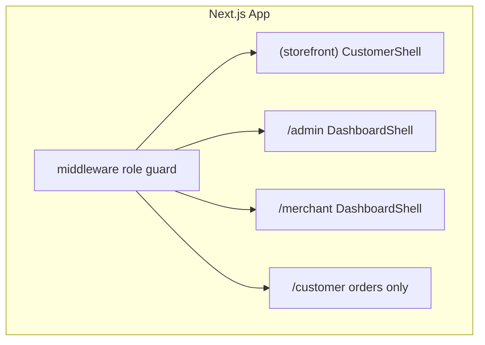

# SestaKıbrıs UI System

Dual-product interface on a single Next.js app: **mobile marketplace** (customers) and **SaaS dashboard** (merchant/admin). Same backend; never mix layouts.

---

## 1. Global architecture



| Role | UI mode | Layout entry |
|------|---------|----------------|
| Guest / customer shopping | Mobile marketplace | `src/app/(storefront)/layout.tsx` → `CustomerShell` |
| Logged-in customer orders | Mobile + `CustomerNav` | `src/app/customer/layout.tsx` |
| Merchant | Desktop dashboard | `src/app/merchant/layout.tsx` → `DashboardShell` |
| Admin | Desktop dashboard | `src/app/admin/layout.tsx` → `DashboardShell` |

**Rule:** Do not render dashboard sidebars on storefront routes or bottom nav on admin pages.

---

## 2. Design tokens

Defined in `src/app/globals.css` (`@theme`):

| Token | Use |
|-------|-----|
| `accent` / `accent-strong` / `accent-soft` | Sky blue — links, active nav, chips |
| `brand-orange` / `brand-orange-soft` | CTAs, cart badge, highlights |
| `brand-navy` | Headings, primary buttons |
| `app-bg` | Page background |
| `border` | Cards, dividers |
| `text-primary` / `text-secondary` / `text-muted` | Typography scale |
| `width-customer` (30rem / 480px) | Customer column max width |

---

## 3. Customer UI (mobile-first)

### Layout

- `CustomerShell` — `src/components/layouts/CustomerShell.tsx`
- Centered column `max-width: 480px`
- Sticky bottom nav on all storefront pages
- `CartBar` when cart has items

### Navigation (`StorefrontBottomNav`)

| Tab | Route |
|-----|--------|
| Ana | `/` |
| Marketler | `/#browse-markets` |
| Ara | `/catalog` |
| Sepet | `/checkout` |
| Siparişler | `/orders/guest` or `/customer/orders` if logged in |

Config: `src/lib/ui/nav-config.ts` → `storefrontTabs()`

### Pages (storefront group)

| Page | Path | Notes |
|------|------|--------|
| Home feed | `/` | Markets + promos |
| Market detail | `/market/[slug]` | Product grid, add to cart |
| Product detail | `/market/[slug]/product/[productSlug]` | |
| Catalog / search | `/catalog` | Global product directory |
| Checkout | `/checkout` | Guest + auth forms |
| Guest track | `/order/[orderId]` | Token-based |
| Guest orders list | `/orders/guest` | |

### Customer-only components

| Component | Path |
|-----------|------|
| `StorefrontBottomNav` | `src/components/customer/StorefrontBottomNav.tsx` |
| `OrderStatusTimeline` | `src/components/customer/OrderStatusTimeline.tsx` |
| `ProductCard` / `ProductGrid` | `src/components/product/` |
| `CartBar` | `src/components/cart/CartBar.tsx` |
| `GuestOrderTracker` | `src/components/order/` |

### UX rules

- No tables, no sidebars, no dense filters
- Large tap targets (`min-h-11` buttons)
- Guest checkout — no forced signup
- Order tracking: 5-step visual timeline

---

## 4. Dashboard UI (desktop-first)

### Layout

- `DashboardShell` — sidebar (md+) + top bar + scrollable main
- Mobile: hamburger nav in `DashboardMobileHeader`; data as **cards**, not tables

### Admin navigation

| Item | Path |
|------|------|
| Panel | `/admin` |
| Siparişler | `/admin/orders` |
| Ürünler | `/admin/catalog` |
| Aktörler | `/admin/actors` |
| Ayarlar | `/admin/catalog/categories` |

### Merchant navigation

| Item | Path |
|------|------|
| Siparişler | `/market/{slug}` |
| Ürünler | `/merchant/products` |
| Envanter | `/merchant/products/browse` |
| Ayarlar | `/merchant/profile` |

Config: `adminNavItems()`, `merchantNavItems(slug)` in `src/lib/ui/nav-config.ts`

### Dashboard-only components

| Component | Path | Purpose |
|-----------|------|---------|
| `DashboardSidebar` | `src/components/dashboard/DashboardSidebar.tsx` | Fixed left nav |
| `DashboardMobileHeader` | `src/components/dashboard/DashboardMobileHeader.tsx` | Collapsible mobile menu |
| `DataTable` | `src/components/dashboard/DataTable.tsx` | Table desktop / cards mobile |

### Admin order table columns (target)

Order ID | Customer | Market | Status | Total | Actions

Use `DataTable` + `StatusChip` when migrating list pages.

---

## 5. Shared UI primitives

`src/components/ui/`:

| Component | File |
|-----------|------|
| Button | `Button.tsx` |
| Badge | `Badge.tsx` |
| Card | `Card.tsx` |
| Alert | `Alert.tsx` |
| Modal | `Modal.tsx` |
| StatusChip | `StatusChip.tsx` |

Utility: `src/lib/ui/cn.ts`

---

## 6. Order status mapping (customer timeline)

| Step | DB statuses |
|------|-------------|
| Alındı | `PENDING` |
| Onaylandı | `CONFIRMED` |
| Hazırlanıyor | `READY` |
| Yolda | `ASSIGNED`, `PICKED_UP`, `IN_TRANSIT` |
| Teslim | `DELIVERED` |

Full labels: `src/lib/orders/order-status-labels.ts`

---

## 7. Responsive rules

### Customer

- Single column only
- `max-width: 480px` centered
- Bottom nav always visible (storefront)
- Typography: `text-base` body, `text-lg` headings on key screens

### Dashboard

- `md+`: sidebar 240px + full tables
- `<md`: hide sidebar, show drawer; `DataTable` renders card stack
- Typography: compact `text-sm` in tables

---

## 8. Component hierarchy

```
src/
├── app/
│   ├── (storefront)/     → CustomerShell
│   ├── admin/            → DashboardShell
│   ├── merchant/         → DashboardShell
│   └── customer/         → CustomerNav (orders sub-app)
├── components/
│   ├── ui/               → Shared primitives
│   ├── layouts/          → CustomerShell, DashboardShell
│   ├── customer/         → StorefrontBottomNav, OrderStatusTimeline
│   ├── dashboard/        → Sidebar, DataTable
│   ├── product/          → Customer cards
│   └── order/            → Guest tracking
└── lib/ui/               → cn, nav-config
```

---

## 9. Future scalability

| Feature | Extension point |
|---------|------------------|
| Delivery map | Customer: new page under `/order/[id]/map`; reuse `OrderStatusTimeline` |
| Analytics | Admin: `/admin/analytics` + chart components in `components/dashboard/charts/` |
| Multi-market | Merchant nav already slug-scoped; admin filters by `merchant_id` in `DataTable` |
| Filters / bulk | `components/dashboard/FiltersPanel.tsx`, `BulkActionsBar.tsx` (not yet built) |

---

## 10. Migration checklist

- [ ] Replace raw `gray-*` / `blue-*` on storefront pages with theme tokens
- [ ] Migrate `admin/catalog` table to `DataTable`
- [ ] Align `customer/layout` with `CustomerShell` + unified bottom nav (optional)
- [ ] Deprecate `HomeBottomNav`, `MerchantNav` (replaced by new nav)
- [ ] Add `FiltersPanel` for admin order history
