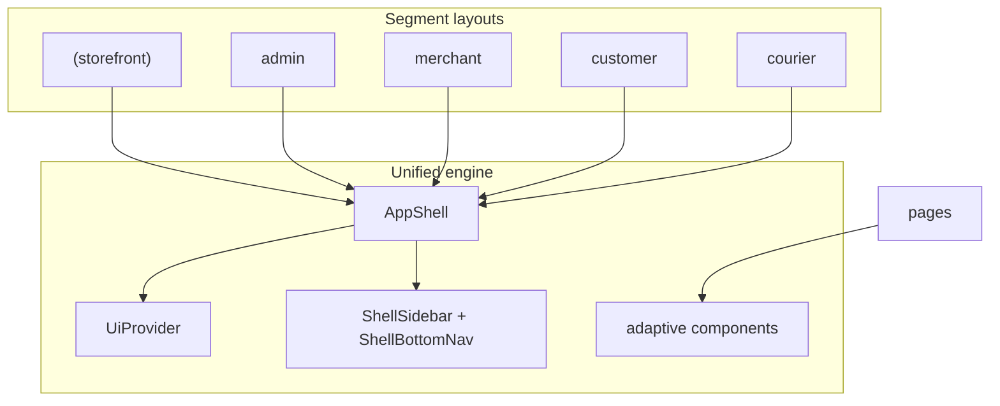

# SestaKıbrıs — Unified Adaptive UI System

One application, one component library, one layout engine. Presentation adapts by **breakpoint** and **UI context** (`consumer` vs `operator`)—not separate apps or duplicate component trees.

---

## Core principle

| Not this | This |
|----------|------|
| Separate mobile app + dashboard app | Same routes, same components |
| `CustomerShell` vs `DashboardShell` | Single [`AppShell`](src/components/layouts/AppShell.tsx) |
| Role-specific Button/Card copies | Shared [`src/components/ui/`](src/components/ui/) + [`adaptive/`](src/components/adaptive/) |

**Roles change density and tools, not pages.**

---

## Architecture



---

## Breakpoints

| Viewport | Tailwind | Navigation | Data layout |
|----------|----------|------------|-------------|
| Mobile | `< md` (768px) | Bottom nav | Single column cards |
| Tablet | `md` – `lg` | Sidebar drawer + bottom nav hidden at lg | 2-column card grids |
| Desktop | `≥ lg` (1024px) | Fixed sidebar + top bar | Operator: tables; consumer: wider grids |

Hooks: [`useBreakpoint`](src/lib/ui/use-breakpoint.ts), [`useUiContext`](src/components/layouts/UiProvider.tsx)

---

## UI context (not separate UIs)

| Context | Routes | Density | Content width |
|---------|--------|---------|---------------|
| `consumer` | `(storefront)`, `customer` | comfortable | Fluid up to `--content-max-consumer` (72rem) |
| `operator` | `admin`, `merchant`, `courier` | compact | Full width in shell |

Set in each segment layout via `<AppShell context="…">`.

---

## App shell

**Files:**

- [`AppShell.tsx`](src/components/layouts/AppShell.tsx) — server-friendly wrapper
- [`AppShellChrome.tsx`](src/components/layouts/AppShellChrome.tsx) — client chrome (drawer state)
- [`ShellSidebar.tsx`](src/components/layouts/ShellSidebar.tsx)
- [`ShellBottomNav.tsx`](src/components/layouts/ShellBottomNav.tsx)
- [`ShellTopBar.tsx`](src/components/layouts/ShellTopBar.tsx)
- [`ShellMain.tsx`](src/components/layouts/ShellMain.tsx)

**Navigation config:** [`src/lib/ui/nav-config.ts`](src/lib/ui/nav-config.ts)

- `consumerNav(ordersHref)`
- `adminNav()`, `merchantNav(slug)`, `courierNav()`

Same `NavItem[]` drives sidebar and bottom nav.

---

## Adaptive components

| Component | Path | Behavior |
|-----------|------|----------|
| `AdaptiveDataView` | `adaptive/AdaptiveDataView.tsx` | Cards → 2-col grid → table (operator) |
| `AdaptiveGrid` | `adaptive/AdaptiveGrid.tsx` | Responsive product/market grid |
| `SplitPanel` | `adaptive/SplitPanel.tsx` | Stack mobile; list + detail on desktop |
| `PageHeader` | `adaptive/PageHeader.tsx` | Title + actions |
| `FiltersBar` | `adaptive/FiltersBar.tsx` | Operator filters; modal on mobile |
| `BulkActionsBar` | `adaptive/BulkActionsBar.tsx` | Operator bulk actions on desktop |

---

## Shared primitives

[`src/components/ui/`](src/components/ui/): `Button`, `Badge`, `Card`, `Alert`, `Modal`, `StatusChip`

Design tokens in [`src/app/globals.css`](src/app/globals.css): accent sky blue, orange highlights, fluid `--spacing-page`.

---

## Layout wiring

| Layout | Context | Title |
|--------|---------|-------|
| `(storefront)/layout.tsx` | consumer | SestaKıbrıs |
| `customer/layout.tsx` | consumer | Siparişlerim |
| `admin/layout.tsx` | operator | Yönetim Paneli |
| `merchant/layout.tsx` | operator | Market name |
| `courier/layout.tsx` | operator | Courier name |

---

## Migrated pages (reference)

- Admin catalog → `AdminCatalogProducts` + `FiltersBar` + `PageHeader`
- Admin orders → `AdminOrdersList`
- Product grid → `AdaptiveGrid`
- Home markets → `AdaptiveGrid` in `MarketBrowseSection`
- Guest order track → `SplitPanel` + map placeholder on desktop

---

## UX philosophy

- **Mobile:** fastest path to action (bottom nav, cards, minimal forms)
- **Tablet:** hybrid (drawer nav, 2-column grids)
- **Desktop:** control and efficiency (sidebar, tables, filters, split panels)

---

## Migration checklist (remaining)

- [ ] Token sweep: replace `gray-*` / `blue-*` on non-migrated pages
- [ ] `AdminOrderAssignment` / `MerchantOrderQueue` → `AdaptiveDataView` where applicable
- [ ] Catalog browse consumer page: optional filters sidebar on `lg+`
- [ ] Analytics widgets under `adaptive/` when Phase 2 analytics ships

---

## Verification

```bash
pnpm typecheck
```

Manual: resize browser across mobile / tablet / desktop on `/`, `/admin/catalog`, `/merchant/products`.
